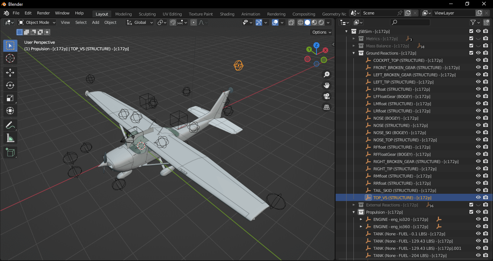

# JSBSim Viewer

  

**JSBSim Viewer** is an extension that lets you import and visualize the spatial layout of [JSBSim](https://github.com/JSBSim-Team/jsbsim) flight dynamics model (FDM) XML data. It reads the XML structure and plots the defined nodes, points, and reference locations in 3D space, allowing you to explore the aircraft’s configuration visually.

This is useful for:

- Inspecting the geometric and reference layout of JSBSim aircraft models.
- Debugging or understanding FDM XML configurations.
- Visualizing how aerodynamic and structural points are positioned relative to each other.

## 🧩 Installation methods

**Requirements:** This extension now requires **Blender 4.2** or newer.  

### ⭐✅ Install from Blender's extensions menu.
1. **Open Blender** → go to **Edit → Preferences → Get Extensions**.
2. Search for "JSBSim Viewer" and click **Install**.

### ✅ Install from Blender Extensions website.
1. Have your Blender open.
2. In your internet browser [visit the extension page](https://extensions.blender.org/add-ons/io-scene-jsbsim/) → click in **Get Add-on** → **Drag and Drop** into your Blender, and confirm.

### ❌ Install manually using the zip file.
1. **Download** the latest `.zip` file for your Blender version from the [Releases page](https://github.com/RenanMsV/JSBSim-Viewer/releases).
2. **Open Blender** → go to **Edit → Preferences → Add-ons**.
3. Click **Install from disk…**, select the downloaded `.zip` file, and confirm.
4. In the Add-ons list, search for and enable **JSBSim Viewer** by checking the box.

⭐ Recommended method of installation.  
✅ Supports **automatic updates**.  
❌ Does not support **automatic updates**.  

## 🚀 Usage

1. In Blender, open **File → Import → JSBSim Flight Dynamics Model (.xml)**.  
2. Select a JSBSim XML file to import.  

